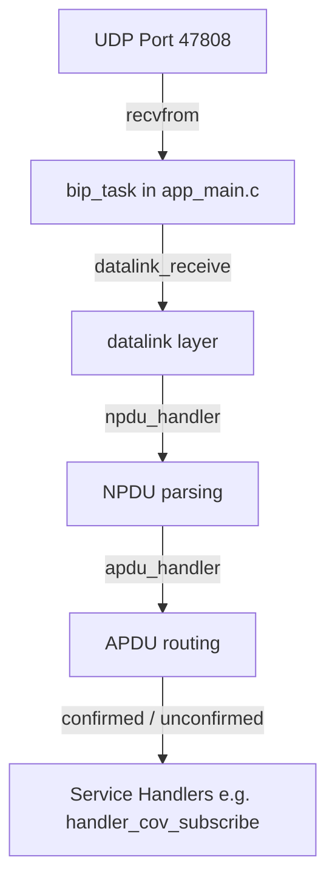

# BACnet Protocol Stack & Flow Guide

This document explains the overall architecture and data flow of the BACnet protocol stack within the T3 controller firmware.

---

## 1. Initialization Flow

When the controller boots, the main task starts BACnet-related services. The initialization steps are:

### Device and Stack Startup
1. **Device Initialization**: In [device.c](T3-programmable-controller-on-ESP32/temco_bacnet/src/device.c), the function `Device_Init()` is called to set up the device object database, including device instance numbers, MAC address parameters, and object lists.
2. **COV Subscription Initialization**: In `Bacnet_Control` startup, `handler_cov_init()` (defined in [h_cov.c](T3-programmable-controller-on-ESP32/temco_bacnet/src/h_cov.c)) is called to clear the unified subscription tracking list `COV_Subscriptions[]` and the address routing list `COV_Addresses[]`.
3. **Handler Registration**: APDU service handlers are registered using functions like `apdu_set_confirmed_handler()` and `apdu_set_unconfirmed_handler()`. This maps service types to handler functions:
   - `SERVICE_CONFIRMED_READ_PROPERTY` $\rightarrow$ `handler_read_property()`
   - `SERVICE_CONFIRMED_WRITE_PROPERTY` $\rightarrow$ `handler_write_property()`
   - `SERVICE_CONFIRMED_SUBSCRIBE_COV` $\rightarrow$ `handler_cov_subscribe()`
   - `SERVICE_UNCONFIRMED_WHO_IS` $\rightarrow$ `handler_who_is()`

---

## 2. Packet Processing and Task Execution

The BACnet stack operates across three main ESP-IDF tasks created in [app_main.c](T3-programmable-controller-on-ESP32/main/app_main.c):

### A. Network Packet Reception (`bip_task`)
- **Execution**: Runs a UDP server bound to port `47808` (`0xBAC0`).
- **Packet Intake**: Blocks on `recvfrom` waiting for incoming BACnet/IP packets.
- **Datalink Processing**: Extracts BACnet Virtual Link Control (BVLC) headers and copies the payload via `datalink_receive()`.
- **NPDU Handler**: Invokes `npdu_handler()` (defined in [h_npdu.c](T3-programmable-controller-on-ESP32/temco_bacnet/src/h_npdu.c)) to extract BACnet source and destination network routing parameters.
- **APDU Router**: Passes the request payload to `apdu_handler()` to extract confirmed or unconfirmed requests, invoking the matching registered service handler.

### B. State Machine Task (`Bacnet_Control` task)
- **Execution**: Runs in a continuous loop every 10ms.
- **COV Handler Task**: Invokes `handler_cov_task(BAC_IP_CLIENT)` every 10ms. This processes the COV state machine (`COV_STATE_MARK`, `COV_STATE_CLEAR`, `COV_STATE_SEND`) to check for changes and dispatch unsent notifications.
- **COV Timer Task**: Every 1000ms (1 second), it invokes `handler_cov_timer_seconds(1)`. This updates active subscription lifetimes, expires dead entries, and does a backup check for changed local inputs, outputs, and variables.

---

## 3. Core API and Service Routing

### Reading Properties
- **API**: `handler_read_property()` in [h_rp.c](T3-programmable-controller-on-ESP32/temco_bacnet/src/h_rp.c)
- **Flow**:
  1. Decodes `monitoredObjectIdentifier` and `propertyIdentifier`.
  2. Invokes object-specific encoding callbacks (e.g. `Analog_Input_Encode_Property_APDU`).
  3. Sends back a Read Property Ack payload containing the requested value.

### Writing Properties
- **API**: `handler_write_property()` in [h_wp.c](T3-programmable-controller-on-ESP32/temco_bacnet/src/h_wp.c)
- **Flow**:
  1. Decodes write parameters (value, tag, priority, and object index).
  2. Updates local registers (`inputs[]`, `outputs[]`, or `vars[]`).
  3. Invokes Modbus or hardware updating commands.
  4. Returns a Simple Ack or Error APDU.
