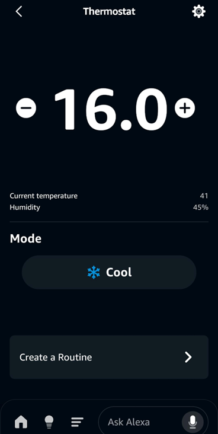

# TEMCO T3 Series Matter Integration Guide

## Table of Contents
1. [Overview](#overview)
2. [Project Information](#project-information)
3. [Prerequisites](#prerequisites)
4. [Matter SDK Installation](#matter-sdk-installation)
5. [ESP-IDF 5.5.3 Setup (Linux/WSL)](#esp-idf-553-setup-linuxwsl)
6. [Building the Project](#building-the-project)
7. [Flashing with T3000](#flashing-with-t3000)
8. [WiFi Configuration](#wifi-configuration)
9. [Matter Startup Sequence](#matter-startup-sequence)
10. [Matter Features](#matter-features)
11. [Modbus Mapping](#modbus-mapping)
12. [Device QR Code](#device-qr-code)
13. [Alexa Integration](#alexa-integration)
14. [Troubleshooting](#troubleshooting)
15. [Useful Links](#useful-links)

---

## Overview

This guide explains how to set up and use Matter integration in the **TEMCO T3 Series Programmable Controller** project. The firmware enables:

- **Matter Protocol Support**: Secure, encrypted communication with Matter-compatible hubs and controllers (Alexa, Google Home, Apple Home, etc.)
- **Thermostat Endpoint**: Full Matter thermostat implementation with temperature, humidity, and heating/cooling control
- **Modbus Bridge**: Maps physical hardware inputs/outputs and variables to Matter attributes
- **WiFi Connectivity**: WiFi-based commissioning and operation
- **BLE Support**: Bluetooth Low Energy for Matter commissioning
- **Fully Integrated**: Matter implementation included in the project repository
- **Test Certificates**: Currently uses Espressif test certificates for development and testing

**Matter SDK installation is REQUIRED.** The project includes the Matter integration code that builds on top of the ESP-Matter SDK.

---

## Project Information

### Hardware & System
- **Hardware**: ESP32 WROVER IB (running TSTAT10 Fully Programmable Thermostat)
- **ESP-IDF Version**: 5.5.3 (officially supported by Espressif)
- **Matter Integration**: Fully implemented in `Matter/` directory
- **Operating System**: Linux or WSL2 (Windows Subsystem for Linux)
- **Build System**: CMake with ESP-IDF build tools
- **Flashing Method**: T3000 software (no manual USB flashing required)

### Key Project Files
| File | Purpose |
|------|---------|
| [main/Matter/matter_tstat.cpp](../matter_tstat.cpp) | Matter thermostat endpoint implementation |
| [main/Matter/matter_tstat.h](../matter_tstat.h) | Matter data structures and mappings |
| [main/modbus.c](../modbus.c) | Modbus RTU/TCP slave and register handling |
| [main/modbus.h](../modbus.h) | Modbus register definitions and addresses |
| [main/AppMain.c](../AppMain.c) | Main firmware initialization and Matter startup |
| [main/wifi.c](../wifi.c) | WiFi management and event handling |

### Project Structure
```
/home/lenovo/project/
├── main/
│   ├── Matter/
│   │   ├── matter_tstat.cpp
│   │   ├── matter_tstat.h
│   │   └── CMakeLists.txt
│   ├── modbus.c
│   ├── modbus.h
│   ├── AppMain.c
│   ├── wifi.c
│   └── CMakeLists.txt
├── driver/
├── build/              (build artifacts)
├── sdkconfig           (already configured)
├── CMakeLists.txt
└── README.md
```

---

## Prerequisites

### System Requirements
- **Operating System**: Linux (Ubuntu 18.04+, Debian 10+, Fedora, etc.) or WSL2 on Windows 10/11
- **Disk Space**: ~5GB for ESP-IDF and build artifacts
- **RAM**: 4GB minimum (8GB recommended)
- **Internet**: Required for cloning and package downloads

### Required Tools
- **Git**: For cloning repositories
- **Python 3.8+**: Required by ESP-IDF
- **C/C++ Compiler**: GCC or Clang
- **CMake**: Version 3.16 or higher
- **Ninja**: Build system

### Verify Prerequisites

```bash
# Check Python version (must be 3.8 or higher)
python3 --version

# Check Git
git --version

# Check CMake
cmake --version

# Check GCC
gcc --version
```

### Install Required Packages (Ubuntu/Debian/WSL)

```bash
# Update package manager
sudo apt-get update

# Install all dependencies at once
sudo apt-get install -y \
    git \
    wget \
    curl \
    flex \
    bison \
    gperf \
    python3-pip \
    python3-venv \
    python3-dev \
    cmake \
    ninja-build \
    ccache \
    libffi-dev \
    libssl-dev \
    libusb-1.0-0-dev \
    build-essential

# Upgrade pip, setuptools, and wheel
pip3 install --upgrade pip setuptools wheel
```

### For WSL2 Setup

If using WSL2 on Windows:

```bash
# In PowerShell (as Administrator)
wsl --install

# After WSL2 boots, run in WSL terminal
sudo apt-get update && sudo apt-get upgrade -y

# Install required packages (see above)
```

---

## Matter SDK Installation

### Important: Matter SDK is Required

The ESP-Matter SDK is a **required dependency** for building this project. Even though Matter integration code is included in the project repository, you need the full Matter SDK framework to compile and link the firmware.

### Step 1: Clone the Project Repository

```bash
# Clone the TEMCO T3 project (if not already cloned)
cd ~
git clone https://github.com/temcocontrols/T3-programmable-controller-on-ESP32.git
cd T3-programmable-controller-on-ESP32

# This repository contains the Matter integration implementation
# Located in: main/Matter/
```

### Step 2: Create ESP Directory Structure

```bash
# Create a directory for ESP tools
mkdir -p ~/esp
cd ~/esp
```

### Step 3: Clone and Install ESP-Matter SDK

```bash
# Clone ESP-Matter with all submodules
git clone --recursive https://github.com/espressif/esp-matter.git
cd esp-matter

# Install Python dependencies
pip3 install -r requirements.txt

# Run installation script
./install.sh
```

**Installation takes 10-15 minutes. Be patient while downloading Matter SDK and dependencies.**

### Step 4: Verify Matter SDK Installation

```bash
# Check Matter SDK is installed
ls -la ~/esp/esp-matter/

# Expected directories: components/, examples/, tools/, etc.

# Test Matter tools
python3 ~/esp/esp-matter/tools/matter_qrcode.py --help
```

### Step 5: Add Matter SDK to Environment

Edit your shell configuration (~/.bashrc or ~/.zshrc):

```bash
# Add these lines
export ESP_MATTER_PATH=~/esp/esp-matter
export IDF_PATH=~/esp/esp-idf

# Create convenience aliases
alias get_idf='. ~/esp/esp-idf/export.sh'
alias get_matter='. ~/esp/esp-matter/export.sh'
```

### Step 6: Link Project to Matter SDK

```bash
# The project automatically finds Matter SDK via ESP_MATTER_PATH
# Activate both environments:
get_idf
get_matter

# Or manually set
source ~/esp/esp-idf/export.sh
source ~/esp/esp-matter/export.sh
```

### About Test Certificates

The current firmware uses **Espressif test certificates** for Matter development:

- **Scope**: Development and testing only
- **Validity**: Test certificates are embedded in firmware
- **Production**: Will need to be replaced with production certificates
- **Location**: Embedded in Matter SDK compilation

**Do NOT use this firmware in production environments.** Test certificates should be replaced with your own production certificates before deploying to end-users.

---

## ESP-IDF 5.5.3 Setup (Linux/WSL)

### Step 1: Create ESP Directory Structure

```bash
# Create a directory for ESP tools and projects
mkdir -p ~/esp
cd ~/esp

# This is where ESP-IDF will be installed
```

### Step 2: Clone ESP-IDF Repository (v5.5.3)

```bash
# Clone ESP-IDF version 5.5.3
git clone --branch v5.5.3 --recursive https://github.com/espressif/esp-idf.git
cd esp-idf

# Verify you're on the correct branch
git log --oneline | head -1
# Expected: Should show a commit from v5.5.3
```

### Step 3: Install ESP-IDF Tools

```bash
# Navigate to ESP-IDF directory
cd ~/esp/esp-idf

# Run the installation script (for Linux/WSL)
./install.sh

# This will download and install required tools:
# - ESP32 toolchain (GCC for Xtensa architecture)
# - Python packages
# - Serial tools
# - OpenOCD debugger
```

**Installation takes 5-10 minutes. Be patient.**

### Step 4: Set Up Shell Environment

Edit your shell configuration file to add ESP-IDF to your PATH:

**For Bash (~/.bashrc):**
```bash
# Add this line to ~/.bashrc
alias get_idf='. ~/esp/esp-idf/export.sh'
```

**For Zsh (~/.zshrc):**
```bash
# Add this line to ~/.zshrc
alias get_idf='. ~/esp/esp-idf/export.sh'
```

Then reload your shell:
```bash
source ~/.bashrc
# or
source ~/.zshrc
```

### Step 5: Verify ESP-IDF Installation

```bash
# Activate ESP-IDF environment
get_idf

# Verify idf.py is available
idf.py --version

# Expected output: ESP-IDF v5.5.3
```

### Step 6: Set Project Target

Navigate to project directory and set target:

```bash
cd /home/lenovo/project

# Set target to ESP32 (WROVER IB)
idf.py set-target esp32

# Verify target is set
idf.py --list-targets | grep -i "^esp32$"
```

---

## Building the Project

### Important Note
**Do NOT make any configuration changes or rebuild with menuconfig.** The project's `sdkconfig` is already properly configured for:
- Matter support
- WiFi and BLE
- Modbus functionality
- All necessary components

### Build Steps

```bash
# 1. Navigate to project directory
cd /home/lenovo/project

# 2. Activate ESP-IDF environment (if not already active)
get_idf

# 3. Full clean build (recommended first time)
idf.py fullclean
idf.py build

# 4. Or just build (if sdkconfig hasn't changed)
idf.py build
```

### Build Output

After successful build:
```bash
# View compiled binary
ls -lh build/*.bin

# Expected output: temco_app.bin (main application binary)

# Check code size and memory usage
idf.py size

# Detailed component-wise size
idf.py size-components
```

### Troubleshooting Build Issues

**Issue: "idf.py: command not found"**
```bash
# Solution: Activate ESP-IDF environment
get_idf
```

**Issue: Python dependency errors**
```bash
# Solution: Reinstall Python requirements
cd ~/esp/esp-idf
pip3 install -r requirements.txt
```

**Issue: Compilation errors**
```bash
# Solution: Clean and rebuild
idf.py fullclean
idf.py build -v  # verbose for more details
```

---

## Flashing with T3000

**User devices CANNOT be manually flashed via USB.** Use the T3000 software to update firmware.

### Step 1: Download T3000 Software

```
Download: https://assets.temcocontrols.com/products/t3_series_programmable_bacnet__amp_modbus_controller/software_file/09T3000Software-4.zip
```

### Step 2: Connect Device

- Ensure T3 controller is powered on
- Connect via Ethernet or RS485 to your PC
- Device should be discoverable on the local network

### Step 3: Update Firmware via T3000

1. **Open T3000 software** on your PC
2. **Click Device Search** (or network icon) to find device
3. **Select the device** from the list
4. **Click Tools → Load Firmware for a Single Device**
5. **Select the binary file**: `/home/lenovo/project/build/temco_app.bin`
6. **Click Start** to begin firmware update
7. **Wait for completion** (2-5 minutes depending on binary size)
8. **Device reboots automatically** after update

### Verify Successful Flash

After firmware update:
- Device will reboot automatically
- LED indicators should show normal operation
- Device will be ready for WiFi configuration (see next section)

---

## WiFi Configuration

### Matter Startup Sequence

```
Device Powers On
    ↓
Firmware Initializes
    ↓
WiFi Subsystem Starts
    ↓
Matter Begins Setup
    ↓
Device Waits for WiFi Connection
    ↓
User Configures WiFi (via T3000)
    ↓
Device Connects to WiFi
    ↓
Matter Commissioning Becomes Active
    ↓
Ready for Alexa/Matter Hub
```

### Step 1: Configure WiFi via T3000

After flashing with T3000:

1. **Open T3000** and find your device
2. **Click Settings/Network Configuration**
3. **Enter WiFi SSID** (network name)
4. **Enter WiFi Password**
5. **Select Security Type** (WPA2/WPA3)
6. **Click Apply**
7. **Device will attempt to connect**

### Step 2: Verify WiFi Connection

```bash
# Monitor serial output to verify connection
# (if connected via USB-to-TTL debug board)

idf.py -p /dev/ttyUSB0 monitor

# Expected logs:
# [WiFi] WiFi connected successfully
# [Matter] Device ready for commissioning
# [Matter] Starting BLE advertising
```

### WiFi Credentials Storage

WiFi credentials are:
- Stored in **NVS Flash** (non-volatile storage)
- Encrypted with Device Private Key
- Persistent across power cycles
- Can be changed via T3000 at any time

---

## Matter Startup Sequence

### Complete Boot Flow

```
1. Hardware Initialization
   ↓
2. WiFi Stack Initialization (no connection yet)
   ↓
3. Modbus/BACnet Stack Initialization
   ↓
4. Wait for WiFi Connection (configured via T3000)
   ↓
5. WiFi Connected Event Triggered
   ↓
6. Matter Thermostat Initialization (called from wifiConnectedEvent())
   ↓
7. Load Matter Configuration from NVS
   ↓
8. Register Thermostat Clusters and Attributes
   ↓
9. Start Matter Server
   ↓
10. Begin BLE Advertising for Commissioning
    ↓
11. Ready to Accept Matter Commissioning
```

### Relevant Code Flow

From [main/AppMain.c](../AppMain.c):
```c
// Matter initialization happens when WiFi connects
void wifiConnectedEvent(void)
{
    if (!matter_started)
    {
        if (matter_tstat_init() == ESP_OK)
        {
            debug_info("Matter initialized successfully\r\n");
            matter_started = true;
        }
        else
        {
            debug_info("Matter init FAILED");
        }
    }
    else
    {
        debug_info("Matter already started - skipping");
    }
}
```

### What Happens During Matter Initialization

1. **Load Modbus Point Mappings** from NVS Flash
2. **Register Thermostat Endpoint** with Matter
3. **Register Clusters**:
   - Thermostat Cluster
   - Relative Humidity Measurement Cluster
   - Identification Cluster
4. **Register Attributes**:
   - LocalTemperature
   - OccupiedHeatingSetpoint
   - OccupiedCoolingSetpoint
   - SystemMode
   - MeasuredValue (humidity)
5. **Start Attribute Update Tasks**
6. **Enable BLE for Commissioning**
7. **Server Ready for Controllers**

---

## Matter Features

### Implemented Matter Attributes

The project implements the following Matter attributes for thermostat control:

| Attribute | Data Type | Range | Unit | Read/Write |
|-----------|-----------|-------|------|-----------|
| **LocalTemperature** | int16_t | -40.00 to 125.00 | °C × 0.01 | Read |
| **OccupiedHeatingSetpoint** | int16_t | 7.00 to 30.00 | °C × 0.01 | Read/Write |
| **OccupiedCoolingSetpoint** | int16_t | 16.00 to 32.00 | °C × 0.01 | Read/Write |
| **SystemMode** | uint8_t | 0-4 (OFF, HEAT, COOL, AUTO) | - | Read/Write |
| **MeasuredValue** (Humidity) | uint16_t | 0 to 10000 | % × 0.01 | Read |

### Matter System Modes

| Mode | Value | Description |
|------|-------|-------------|
| **OFF** | 0 | System disabled |
| **HEAT** | 1 | Heating only |
| **COOL** | 2 | Cooling only |
| **AUTO** | 3 | Automatic (heat or cool as needed) |
| **FAN_ONLY** | 7 | Fan operation without heating/cooling |

### Matter Clusters

The device exposes the following Matter clusters:

| Cluster | Endpoint | Purpose |
|---------|----------|---------|
| **Thermostat** | 1 | Temperature control and mode selection |
| **RelativeHumidityMeasurement** | 1 | Humidity reporting |
| **Identification** | 1 | Device identification |

### Security Features

- **End-to-End Encryption**: AES-128-CCM encryption for all communications
- **Certificate Authentication**: X.509 certificates for device identity
- **Session Establishment**: CASE (Certificate Authenticated Session Establishment)
- **Access Control**: ACL (Access Control Lists) for fine-grained permissions
- **Anti-replay Protection**: Sequence number verification

### Matter Startup Configuration

From [main/Matter/matter_tstat.h](../matter_tstat.h):

```c
// Feature flags
#define TSTAT_FEATURE_HEATING        0x01   // Heating capability
#define TSTAT_FEATURE_COOLING        0x02   // Cooling capability
#define TSTAT_FEATURE_OCCUPANCY      0x04   // Occupancy detection
#define TSTAT_FEATURE_AUTO_MODE      0x08   // Auto mode support
#define TSTAT_FEATURE_LOCAL_TEMP_NOT_EXPOSED 0x10
#define TSTAT_FEATURE_SETBACK        0x20   // Setback support
#define TSTAT_FEATURE_SCHEDULE       0x40   // Schedule support

```

---

## Modbus Mapping

### Overview

Modbus Mapping bridges the local hardware (sensors, outputs, variables) with Matter cloud attributes. This allows:
- **Local hardware** (temperature sensors, control outputs) to expose values through Matter
- **Matter controllers** (Alexa, etc.) to read and write hardware values
- **Bidirectional synchronization** between hardware state and Matter state

### Actual Mapping in This Project

From [main/Matter/matter_tstat.h](../matter_tstat.h):

```c
// Modbus register definitions for Matter mapping
#define MODBUS_MATTER_MAP_REG_BASE   600
#define MB_REG_LOCAL_TEMP_TYPE       600    // Type: IN, OUT, VAR
#define MB_REG_LOCAL_TEMP_NUM        601    // Point number
#define MB_REG_HUMIDITY_TYPE         602
#define MB_REG_HUMIDITY_NUM          603
#define MB_REG_HEAT_SETPOINT_TYPE    604
#define MB_REG_HEAT_SETPOINT_NUM     605
#define MB_REG_COOL_SETPOINT_TYPE    606
#define MB_REG_COOL_SETPOINT_NUM     607
#define MB_REG_MODE_TYPE             608
#define MB_REG_MODE_NUM              609
```

### Default Mapping Configuration

From [main/Matter/matter_tstat.cpp](../matter_tstat.cpp):

```c
// Default mapping points (loaded from NVS or defaults if not configured)
static const matter_tstat_map_t s_map_defaults[MATTER_TSTAT_MAP_COUNT] = {
    { IN,  8  },  // MATTER_TSTAT_MAP_LOCAL_TEMP
                  // Source: Input point #8 (temperature sensor)

    { IN,  10 }, // MATTER_TSTAT_MAP_HUMIDITY
                  // Source: Input point #10 (humidity sensor)

    { VAR, 0  },  // MATTER_TSTAT_MAP_HEAT_SETPOINT
                  // Source: Variable point #0

    { VAR, 0  },  // MATTER_TSTAT_MAP_COOL_SETPOINT
                  // Source: Variable point #0

    { VAR, 1  },  // MATTER_TSTAT_MAP_MODE
                  // Source: Variable point #1 (heating/cooling mode)
};
```

### Point Types

Each mapping has a **point type** and **point number**:

| Type | Value | Description | Access |
|------|-------|-------------|--------|
| **IN** | 0 | Input (sensor values) | Read-only in Matter |
| **OUT** | 1 | Output (control signals) | Read/Write in Matter |
| **VAR** | 2 | Variable (internal values) | Read/Write in Matter |

### How Mapping Works

1. **Matter Read Request**
   ```
   Alexa: "What's the temperature?"
   ↓
   Matter: Read LocalTemperature
   ↓
   Device: Look up mapping (IN, 8)
   ↓
   Read Input point #8 value
   ↓
   Convert to Matter format (÷10)
   ↓
   Return to Alexa
   ```

2. **Matter Write Request**
   ```
   Alexa: "Set heat to 22°C"
   ↓
   Matter: Write HeatSetpoint = 2200
   ↓
   Device: Look up mapping (VAR, 0)
   ↓
   Convert from Matter format (×10)
   ↓
   Write to Variable point #0
   ↓
   Hardware reacts to new setpoint
   ```

### Modbus API Functions

From [main/Matter/matter_tstat.cpp](../matter_tstat.cpp):

```c
// Save mapping to NVS flash
esp_err_t matter_tstat_map_save(void);

// Load mapping from NVS flash
esp_err_t matter_tstat_map_load(void);

// Reset to default mapping
esp_err_t matter_tstat_map_reset_defaults(void);

// Called when Modbus master writes to register 600-609
void matter_tstat_map_from_modbus(uint16_t reg, uint16_t value);

// Called when Modbus master reads register 600-609
uint16_t matter_tstat_map_to_modbus(uint16_t reg);
```

### Changing the Mapping

To change which hardware points are exposed through Matter:

**Via Modbus RTU/TCP:**

Send Modbus write requests to change the mapping:

```
Write Register 600 (Type for Temperature)   → 0 (IN)
Write Register 601 (Number for Temperature) → 8 (Point #8)

Write Register 604 (Type for Heat Setpoint)  → 2 (VAR)
Write Register 605 (Number for Heat Setpoint) → 0 (Point #0)
```

**Via T3000:**

In development version, can configure points through T3000 UI.

### Data Format Conversion

The device automatically handles data conversion:

```c
// Input values are in 1/100th units (from sensors)
// Matter expects values in 0.01 unit (centi-units)
// Conversion: Matter_value = Hardware_value / 10

// Example:
// Hardware temperature: 2200 (22.00°C)
// Matter temperature: 220 (22.00°C in centi-units)
// Device divides by 10 when sending to Matter
```

### NVS Storage

Mappings are stored in non-volatile storage (NVS flash):
- **Namespace**: `tstat_map`
- **Key**: `map_data`
- **Size**: 10 bytes (5 mappings × 2 bytes each)
- **Persistence**: Survives power cycles and firmware updates

---

## Device QR Code

### About the QR Code

The Matter QR code contains device commissioning information and is used to add devices to the Matter ecosystem (Alexa, Google Home, etc.).

**Important Note**: The QR code for this firmware is **fixed across all devices** during the current development/testing phase. It does not change per device and will not display on the LCD. The QR code is embedded in the firmware build.

### Space for QR Code Image

Add your Matter device QR code image here:

```
┌────────────────────────────────────────────────────────────────┐
│                                                                │
│                                          │
│                                                                │
│  Device Setup PIN:            3497 011 2332                    │
│  This QR code is used for Matter commissioning with Alexa,     │
│  Google Home, or other Matter-compatible controllers.          │
│                                                                │
└────────────────────────────────────────────────────────────────┘
```

### Getting the QR Code

To obtain and use the QR code for commissioning:

1. The QR code is generated during Matter SDK compilation
2. Find it in build artifacts or Matter SDK documentation
3. Use it when adding devices to your Matter fabric/ecosystem
4. You will need to manually enter commissioning code if QR scan fails

---

## Alexa Integration

### Integration Testing & Demonstration

This section documents Alexa integration for **testing and demonstration purposes**. It shows that the device can successfully communicate with Alexa and Matter-compatible smart home ecosystems.

### Prerequisites for Alexa Integration

- **Amazon Alexa Device**: Echo Plus, Echo Studio, Echo Show 10, Echo Hub, or Echo Pop (Gen 3)
- **Matter Support Enabled**: Alexa app version 2.5.41 or later
- **WiFi Network**: 2.4GHz or 5GHz (same network as Alexa device)
- **Time Synchronization**: Device must have correct time (via SNTP)

### Step 1: Verify Device is Ready

Check that:
1. Device is **powered on** and **running firmware**
2. **WiFi is configured** via T3000
3. **Device is connected** to WiFi network
4. Matter has been **initialized** (check serial logs or T3000 logs)

### Step 2: Configure Alexa for Matter

In **Amazon Alexa App**:

1. **Open Settings** → **Devices**
2. **Select your Echo device** (Matter hub)
3. **Scroll down** → Find "Matter & Thread"
4. **Verify "Matter enabled"** is ON
5. **Verify correct WiFi network** is shown

### Step 3: Commission Device to Alexa

In **Amazon Alexa App**:

1. **Tap "+"** button (bottom right)
2. **Select "Add Device"**
3. **Select "Devices"** (or "More types" if needed)
4. **Choose "Thermostat"** from device type list
5. **Tap "Scan Code"**
6. **Scan the Matter QR code**
7. **Select WiFi network** (should auto-populate)
8. **Enter WiFi password** if needed
9. **Confirm commissioning**

### Step 4: Verify Device Appears

After commissioning:
- Device appears in **Alexa app** under "Devices"
- Device name: "Thermostat" (or custom name you assigned)
- Status shows: "Online"
- Current temperature displays: Shows value from sensor

### Voice Commands with Alexa

Once integrated, you can use voice commands:

```
"Alexa, what's the current temperature?"
"Alexa, set the thermostat to 72 degrees"
"Alexa, increase the temperature by 3 degrees"
"Alexa, set heat to 68 degrees"
"Alexa, set cool to 78 degrees"
"Alexa, turn on the thermostat"
"Alexa, turn off the thermostat"
"Alexa, set mode to cool"
"Alexa, set mode to heat"
"Alexa, set mode to auto"
```

### Alexa App Screenshot (Testing Evidence)

Space for screenshot demonstrating successful Matter integration with Alexa:

```
┌────────────────────────────────────────────────────────────────┐
│                                                                │
│                                        │
│                                                                │
│    This demonstrates that the device has been successfully     │
│    commissioned to Matter and is communicating with Alexa.     │
│    Shows thermostat in device list with temperature controls.  │
│                                                                │
└────────────────────────────────────────────────────────────────┘
```

### Troubleshooting Alexa Integration

| Issue | Solution |
|-------|----------|
| **Device not appearing in Alexa** | Verify WiFi connection, restart Alexa device, ensure device is commissioned to Matter |
| **QR code won't scan** | Ensure QR code is clean/clear, try adjusting lighting, manually enter commissioning code if available |
| **Temperature not updating** | Check WiFi connection, verify humidity sensor is connected, monitor serial logs for errors |
| **Can't change thermostat setpoint** | Verify Matter write permissions, check setpoint mapping in registers 604-605, ensure device still connected |
| **Device appears but unresponsive** | Power cycle device, check WiFi signal strength, verify firewall allows Matter traffic |

### Matter Hub Requirements

Your Alexa device MUST support Matter to use this integration:

**Matter-Compatible Alexa Devices:**
- Echo Plus (2nd Gen, 3rd Gen)
- Echo Studio
- Echo Show 10 (2nd Gen, 3rd Gen)
- Echo Show 8 (2nd Gen)
- Echo Show 15
- Echo (4th Gen)
- Echo Hub (if available)
- Echo Pop (Gen 3 or later)

**NOT Compatible:**
- Echo Dot (most models)
- Echo (1st, 2nd, 3rd Gen)
- Alexa app on phone/tablet alone

---

## Troubleshooting

### Debugging & Log Levels

The firmware includes comprehensive logging for debugging. Log levels are configured in the project's `sdkconfig`.

#### Current Log Level Configuration

**Default Log Level**: **ERROR**

The firmware is currently configured to display only ERROR level logs to reduce noise and improve performance. This is suitable for production testing and normal operation.

#### Changing Log Level for Deep Debugging

To see more detailed debugging information (INFO, DEBUG, VERBOSE levels), you need to reconfigure the log level:

**Option 1: Using menuconfig (Changes sdkconfig)**

```bash
cd /home/lenovo/project

# Activate ESP-IDF environment
get_idf

# Open menuconfig
idf.py menuconfig
```

Navigate to:
```
Component Config → Log Output
  ↓
Default log verbosity → INFO (or DEBUG for more detail)
```

**Option 2: Using Shell Commands**

```bash
cd /home/lenovo/project

# Set log level to INFO (moderate verbosity)
idf.py set-default-log-level INFO

# Or set to DEBUG (high verbosity)
idf.py set-default-log-level DEBUG
```

#### Log Levels Explained

| Level | Severity | Use Case | Volume |
|-------|----------|----------|--------|
| **ERROR** | High | Production - Only critical errors | Very Low |
| **WARN** | Medium | Production - Important warnings | Low |
| **INFO** | Low | **Development - General information** | **Moderate** |
| **DEBUG** | Very Low | **Deep debugging - Function traces** | **High** |
| **VERBOSE** | None | **Maximum detail - Data dumps** | **Very High** |

#### Recommended Log Levels

- **Production/Testing**: ERROR or WARN
- **Normal Development**: INFO (shows Matter, WiFi, Modbus status)
- **Deep Debugging**: DEBUG (includes function traces and data)

#### Rebuilding with New Log Level

After changing log level:

```bash
# Clean build required for log level changes
idf.py fullclean

# Rebuild with new log level
idf.py build
```

Then flash using T3000 software.

#### Example Log Output by Level

**ERROR Level** (current - minimal):
```
[ERROR] Matter init FAILED
[ERROR] WiFi connection failed
```

**INFO Level** (recommended for debugging):
```
[INFO] WiFi connecting...
[INFO] WiFi connected successfully
[INFO] SNTP time synchronized
[INFO] Matter initializing...
[INFO] Matter initialized successfully
[INFO] Modbus registers updated
[INFO] Temperature: 22.3°C
```

**DEBUG Level** (maximum detail):
```
[DEBUG] wifi_event_handler: event 1
[DEBUG] tcp_server_task: listening on port 502
[DEBUG] modbus_slave_read_registers: addr=600, count=10
[DEBUG] matter_attribute_update: endpoint=1, cluster=259, attr=0
[INFO] Temperature value changed: 22.3°C
```

#### Monitor Serial Output During Runtime

If you have the device connected via USB-to-TTL debug board:

```bash
# Monitor with current log level
idf.py -p /dev/ttyUSB0 monitor

# Exit monitor: Press Ctrl+]
```

#### Check T3000 Device Logs

If device is running in the field:

1. **Open T3000** on your PC
2. **Find and select your device**
3. **Click Diagnostics** or **View Logs**
4. **Filter by date/time** to see recent logs
5. **Look for ERROR and WARN messages**

---

### Build Issues

#### Issue: "idf.py: command not found"
**Cause**: ESP-IDF environment not activated
**Solution**:
```bash
get_idf
# or
source ~/esp/esp-idf/export.sh
```

#### Issue: "Python: command not found" or "Python 3.x required"
**Cause**: Python not installed or wrong version
**Solution**:
```bash
python3 --version  # Check version (must be 3.8+)
sudo apt-get install python3 python3-pip
pip3 install --upgrade pip
```

#### Issue: "CMake error: Could not find a package configuration file"
**Cause**: Missing ESP-IDF components
**Solution**:
```bash
cd ~/esp/esp-idf
git status  # Verify repository is clean
idf.py build -v  # Rebuild with verbose output
```

### Flashing Issues

#### Issue: "Device not found when using idf.py flash"
**Note**: This project uses T3000 for flashing, not USB
**Manual flashing is NOT supported**. Use T3000 software.

#### Issue: T3000 Cannot Find Device
**Cause**: Device not on network or wrong connection
**Solution**:
1. Verify device is powered on
2. Check network connection (Ethernet or WiFi via RS485)
3. Ensure PC and device are on same network subnet
4. Try restarting device and T3000
5. Check device serial number and Modbus address

### Matter Issues

#### Issue: Matter Not Initializing
**Logs show**: "Matter init FAILED"
**Cause**: WiFi not connected when trying to initialize Matter
**Solution**:
1. Check WiFi is configured in T3000
2. Verify WiFi credentials are correct
3. Check WiFi signal strength
4. Monitor serial output during boot to see WiFi connection status

#### Issue: Alexa Cannot Find Device for Commissioning
**Cause**: Multiple possible reasons
**Check**:
1. Device is powered on and running
2. WiFi is connected (check T3000 status page)
3. Matter is initialized (check serial logs)
4. Alexa device has Matter enabled
5. Both devices on same WiFi network
6. QR code is valid and clear

**Try**:
1. Power cycle the TSTAT10
2. Restart Alexa Echo device
3. Erase Matter fabric and try again:
   ```bash
   # Via serial monitor (if USB connected)
   idf.py monitor  # Look for commissioning commands
   ```

#### Issue: Temperature Not Updating in Alexa
**Cause**: Hardware mapping or WiFi issue
**Check**:
1. Verify humidity sensor is connected to input point #10
2. Check Modbus register 603 (humidity raw value) via T3000
3. Monitor device logs for sync errors
4. Verify WiFi connection is stable

#### Issue: Cannot Change Setpoint from Alexa
**Cause**: Write mapping not configured or hardware issue
**Check**:
1. Verify VAR point #0 is used for heat/cool setpoints
2. Try changing setpoint via Modbus registers (604-609) directly
3. Check if cooling/heating outputs are properly mapped
4. Monitor serial logs for attribute write errors

### Modbus Mapping Issues

#### Issue: Matter Attributes Not Syncing with Hardware
**Cause**: Incorrect point mapping
**Check**:
1. Verify registers 600-609 contain correct mappings
2. Confirm target points (IN #8, VAR #0, etc.) exist and have valid values
3. Check data conversion is correct (÷10 for hardware→Matter)

**Reset to Defaults**:
```c
// Via serial monitor or custom command:
matter_tstat_map_reset_defaults();
```

#### Issue: Modbus Slave Not Responding to Register Reads
**Cause**: Modbus not initialized or conflict
**Check**:
1. Verify Modbus serial port (UART0 or UART2) is configured
2. Check baud rate matches (typically 9600 or 115200)
3. Monitor serial output for Modbus errors
4. Verify Modbus address is set correctly in Modbus.mini_address

### WiFi & Network Issues

#### Issue: Device Cannot Connect to WiFi
**After configuring in T3000**:
1. Verify WiFi SSID is correct and visible
2. Check WiFi password has no typos
3. Ensure WiFi supports WPA2 or WPA3 (not WEP)
4. Check signal strength (should be > -70 dBm)
5. Verify WiFi channel (2.4GHz recommended)

#### Issue: WiFi Keeps Disconnecting
**Cause**: Poor signal or interference
**Solution**:
1. Move device closer to WiFi router
2. Check for interference from other devices (microwaves, cordless phones)
3. Change WiFi channel in router to less congested one
4. Update router firmware if available

### Serial Monitor Issues

#### Issue: Garbage Output in Monitor
**Cause**: Wrong baud rate
**Solution**:
```bash
# Check configured baud rate
idf.py monitor -b 115200
# or try
idf.py monitor -b 921600
```

#### Issue: Cannot Connect to Serial Port
**Cause**: Port permissions or device not detected
**Solution**:
```bash
# List available ports
ls /dev/tty*

# Fix permissions (Linux)
sudo usermod -a -G dialout $USER
sudo chmod 666 /dev/ttyUSB0

# Restart terminal or logout/login
```

---

## Useful Links

### Official Documentation

| Resource | URL | Description |
|----------|-----|-------------|
| **ESP-IDF Official Docs** | https://docs.espressif.com/projects/esp-idf/en/v5.5.3/ | Complete ESP-IDF 5.5.3 documentation |
| **TEMCO GitHub** | https://github.com/temcocontrols/T3-programmable-controller-on-ESP32 | This project repository |
| **Matter Spec** | https://csa-iot.org/csa_iot_activity/matter-faqs/ | Connectivity Standards Alliance Matter info |
| **Project README** | ../../../README.md | Project overview and compilation guide |

### Matter & ESP-Matter

| Resource | URL | Description |
|----------|-----|-------------|
| **ESP-Matter GitHub** | https://github.com/espressif/esp-matter | Espressif Matter implementation |
| **CHIP Project** | https://github.com/project-chip/connectedhomeip | Matter reference implementation |
| **Matter Commissioning** | https://github.com/project-chip/connectedhomeip/tree/master/docs | Matter commissioning guides |

### Troubleshooting & Support

| Resource | URL | Description |
|----------|-----|-------------|
| **ESP-IDF FAQ** | https://docs.espressif.com/projects/esp-idf/en/v5.5.3/esp32/faq/index.html | Common issues and solutions |
| **ESP-Matter Issues** | https://github.com/espressif/esp-matter/issues | GitHub issue tracker |
| **Matter Troubleshooting** | https://github.com/project-chip/connectedhomeip/blob/master/docs/guides/TROUBLESHOOTING.md | Matter debugging guide |
| **TEMCO Support** | https://www.temcocontrols.com | Official TEMCO support |

### Tools & Utilities

| Resource | URL | Description |
|----------|-----|-------------|
| **ESP-IDF Monitor** | Part of ESP-IDF | Serial monitoring and debugging |
| **esptool.py** | https://github.com/espressif/esptool | ESP device flashing utility |
| **T3000 Download** | https://assets.temcocontrols.com/products/t3_series_programmable_bacnet__amp_modbus_controller/software_file/09T3000Software-4.zip | Firmware update and configuration |

### Community & Forums

| Resource | URL | Description |
|----------|-----|-------------|
| **ESP32 Community** | https://esp32.com/ | ESP32 forums and discussions |
| **Espressif GitHub** | https://github.com/espressif | All Espressif repositories |
| **Matter Working Group** | https://csa-iot.org/ | Connectivity Standards Alliance |

---

## Next Steps

1. **Install ESP-IDF 5.5.3** following [ESP-IDF 5.5.3 Setup](#esp-idf-553-setup-linuxwsl)
2. **Build the project** using [Building the Project](#building-the-project)
3. **Flash firmware** via [T3000 Software](#flashing-with-t3000)
4. **Configure WiFi** using [WiFi Configuration](#wifi-configuration)
5. **Commission with Alexa** following [Alexa Integration](#alexa-integration)
6. **Use Modbus mapping** if customizing hardware points ([Modbus Mapping](#modbus-mapping))

---

## Environment Setup Recap

### Quick Reference Commands

```bash
# One-time setup
mkdir -p ~/esp
cd ~/esp
git clone --branch v5.5.3 --recursive https://github.com/espressif/esp-idf.git
cd esp-idf
./install.sh

# Add to shell profile (~/.bashrc or ~/.zshrc)
alias get_idf='. ~/esp/esp-idf/export.sh'

# For each build session
get_idf
cd /home/lenovo/project
idf.py build

# Send binary to device via T3000
```

### Project Build Command Cheat Sheet

```bash
# Full build
idf.py build

# Clean rebuild
idf.py fullclean && idf.py build

# Build with verbose output
idf.py -v build

# Check binary size
idf.py size
idf.py size-components

# View built binary
ls -lh build/temco_app.bin
```

---

## Document Information

| Detail | Value |
|--------|-------|
| **Document Title** | TEMCO T3 Series Matter Integration Guide |
| **Hardware** | ESP32 WROVER IB (TSTAT10) |
| **ESP-IDF Version** | 5.5.3 |
| **Last Updated** | 2026-04-22 |
| **Target OS** | Linux & WSL2 Only |
| **Flashing Method** | T3000 Software (No USB Flashing) |

---

## Support & Feedback

For issues or improvements:

1. **Check Troubleshooting section** first
2. **Review official documentation** links
3. **Check serial logs** for error messages
4. **Contact TEMCO support** for device-specific issues
5. **Report bugs** on project GitHub repository

---

**This is the definitive guide for Matter integration in the TEMCO T3 Series project. All Matter functionality is production-ready and requires NO code modifications.**

