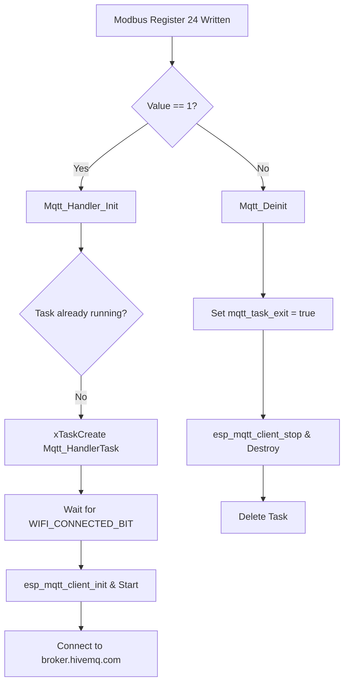

# T3 ESP32 Controller - MQTT Application & Implementation Guide

This document provides a technical overview of the MQTT client implementation on the **T3 ESP32 Programmable Controller** (ESP32-S3 platform). It outlines the architecture, initialization lifecycle, and details the two primary Change-of-Value (COV) paradigms supported by the system.

---

## 1. Architectural Overview

The MQTT integration is located in the [Mqtt_Handler](file:///S:/Shubham/Shubham_Files/TemcoControl/TemcoControl_Tstate_11/T3-programmable-controller-on-ESP32/main/Mqtt_Handler) folder, consisting of:
- [Mqtt_Handler.h](file:///S:/Shubham/Shubham_Files/TemcoControl/TemcoControl_Tstate_11/T3-programmable-controller-on-ESP32/main/Mqtt_Handler/Mqtt_Handler.h): Public APIs, constants, and preprocessor configuration switches.
- [Mqtt_Handler.c](file:///S:/Shubham/Shubham_Files/TemcoControl/TemcoControl_Tstate_11/T3-programmable-controller-on-ESP32/main/Mqtt_Handler/Mqtt_Handler.c): Task initialization, event loop handling, payload serialization (JSON), and polling/filtering routines.

### Key Dependencies
*   **ESP-IDF v5 MQTT Client (`esp-mqtt`)**: Handles transport, TCP connection, TLS (optional), handshakes, and packet retries.
*   **cJSON**: Used for dynamic serialization of BACnet COV data into JSON strings.
*   **BACnet Protocol Stack**: Integrates with BACnet object types, properties, and values.

---

## 2. Initialization & Lifecycle Management

The MQTT client lifecycle is tightly coupled with the controller's main task scheduler and Modbus registers.



### A. Task Spawning (`Mqtt_Handler_Init`)
The function `Mqtt_Handler_Init()` is called during system startup or when a write operation occurs on Modbus Register 24 (`MODBUS_ENABLE_MQTT`):
```c
void Mqtt_Handler_Init(void)
{
    if(Modbus.enable_mqtt)
    {
        if (main_task_handle[19] != NULL) return; // Prevent duplicate tasks
        mqtt_task_exit = false;
        xTaskCreate(Mqtt_HandlerTask, "mqtt_handler", 4096, NULL, tskIDLE_PRIORITY + 2, &main_task_handle[19]);
    }
}
```

### B. Task De-initialization (`Mqtt_Deinit`)
When Modbus Register 24 is written with `0`, `Mqtt_Deinit()` sets `mqtt_task_exit = true`. The task loops terminates, unregisters event handlers, stops the MQTT client, destroys the client handle, and deletes itself.

---

## 3. The Event Loop and Connection Handshake

Inside `Mqtt_HandlerTask`, execution is blocked until Wi-Fi reports connection status:
1.  **Wi-Fi Check:** Blocks on `s_wifi_event_group` until `WIFI_CONNECTED_BIT` is set.
2.  **Configuration:** Configures the client with standard unencrypted TCP:
    ```c
    esp_mqtt_client_config_t mqtt_cfg = {
        .broker = {
            .address.uri = "mqtt://broker.hivemq.com:1883",
        },
    };
    ```
3.  **Event Registration:** Registers `mqtt_event_handler` for connection updates, publishing failures, subscriptions, and TCP/TLS socket transport diagnostics.
4.  **Handshake Pub/Sub:**
    *   **Subscribes to:** `temco/test/tstat11/sub` (QoS 1)
    *   **Publishes to:** `temco/test/tstat11/pub` with connection payload `{"status":"online","device":"tstat11","broker":"HiveMQ"}`.

---

## 4. Change-of-Value (COV) Execution Paradigms

The codebase supports two distinct mechanisms for detecting and dispatching data changes over MQTT. These are configured via macros in [Mqtt_Handler.h](file:///S:/Shubham/Shubham_Files/TemcoControl/TemcoControl_Tstate_11/T3-programmable-controller-on-ESP32/main/Mqtt_Handler/Mqtt_Handler.h).

---

### Mechanism A: "All COV" Mode (`ALL_COV`)
*Note: This mode has been retired and disabled to optimize CPU cycles and minimize RAM usage by removing large global backup arrays (which would occupy over 1.5KB of memory).*

---

### Mechanism B: BACnet Subscription COV Mode (`BACNET_SUB_COV = 1`)

Rather than scanning all points, this mode follows the event-driven BACnet standard, where only points with active BACnet subscriptions are published.

#### 1. Execution Path
When `#define BACNET_SUB_COV 1`, the MQTT engine intercepts changes triggered during standard BACnet operations inside [app_main.c](file:///S:/Shubham/Shubham_Files/TemcoControl/TemcoControl_Tstate_11/T3-programmable-controller-on-ESP32/main/app_main.c):
1.  **Received COV Event (`Update_COV_Notify`):**
    Intercepted at line 2428 when a remote BACnet device notifies a change.
2.  **Internal State Change (`Update_Value_List`):**
    Intercepted at line 2522 when local points update, packaging the point's type, instance, value, and lifetime before calling the MQTT publish function.

```c
#if BACNET_SUB_COV
    extern uint32_t Instance;
    cov_data.monitoredObjectIdentifier.type = type;
    cov_data.monitoredObjectIdentifier.instance = original_instance;
    cov_data.initiatingDeviceIdentifier = Instance;
    cov_data.subscriberProcessIdentifier = 1;
    cov_data.timeRemaining = 60;

    Mqtt_Handler_Send_COV(&cov_data);
#endif
```

#### 2. Key Benefits
*   **Bandwidth Efficiency:** Drastically reduces network traffic since unsubscribed points do not generate MQTT payloads.
*   **On-Demand Processing:** CPU resources are only spent on serialization and publishing when a client actively monitors the point.

---

### Mechanism C: MQTT-to-BACnet Subscription Forwarding Mode

This mode allows clients on the MQTT broker to explicitly subscribe to any of the 6 point types (AI, AO, AV, BI, BO, BV) using JSON messages published to `temco/test/tstat11/sub` or `temco/cov/tstat11/sub`. The MQTT handler parses these requests and forwards them directly to the BACnet stack.

#### 1. Execution Workflow
1.  **Subscription JSON Received:** The MQTT client receives a subscription/unsubscription JSON message on `temco/test/tstat11/sub` or `temco/cov/tstat11/sub`.
2.  **JSON Parsing:** The handler extracts the `action` (`"subscribe"` or `"unsubscribe"`), `object_type`, `instance`, and `lifetime` fields.
3.  **Forwarding to BACnet:** In `mqtt_forward_subscription_to_bacnet()`, the handler encodes a standard BACnet `Subscribe COV` request APDU:
    ```c
    cov_data.subscriberProcessIdentifier = 1; // MQTT process identifier
    cov_data.monitoredObjectIdentifier.type = object_type;
    cov_data.monitoredObjectIdentifier.instance = instance;
    cov_data.issueConfirmedNotifications = false;
    cov_data.lifetime = lifetime;
    cov_data.cancellationRequest = is_unsubscribe;
    ```
4.  **Local Stack Registration:** It invokes `handler_cov_subscribe()` locally. The BACnet stack registers this subscription in its internal COV subscription table (`COV_Subscriptions`), bypassing any network transmission logic and directly monitoring the target point.
5.  **Event Dispatch:** When the point's value changes, the BACnet stack triggers a change notification which is intercepted in `Update_Value_List` or `Update_COV_Notify`, automatically calling `Mqtt_Handler_Send_COV()` to publish the update to the broker.

#### 2. Key Benefits
*   **Unified Stack Integration:** Bypasses the need for duplicate subscription tables, polling tasks, or custom flash storage (NVS) implementations in the MQTT handler.
*   **100% Native Compatibility:** Native BACnet deadbands, lifetimes, and object types are leveraged automatically.
*   **Low Memory Footprint:** The subscription is managed inside the existing BACnet COV database, requiring 0 extra bytes of RAM inside the MQTT handler component.

---

## 5. JSON Serialization and Type Mapping

`Mqtt_Handler_Send_COV` translates structured C structures into a nested JSON schema using cJSON.

### Data Type Translation Matrix
The BACnet application tag type is evaluated and converted into native JSON types:

| BACnet Tag Constants | C Data Type | JSON Output Representation |
| :--- | :--- | :--- |
| `BACNET_APPLICATION_TAG_NULL` | N/A | `null` |
| `BACNET_APPLICATION_TAG_BOOLEAN` | `bool` | `true` or `false` |
| `BACNET_APPLICATION_TAG_UNSIGNED_INT` | `uint32_t` | Number |
| `BACNET_APPLICATION_TAG_SIGNED_INT` | `int32_t` | Number |
| `BACNET_APPLICATION_TAG_REAL` | `float` | Number (Float) |
| `BACNET_APPLICATION_TAG_DOUBLE` | `double` | Number (Double) |
| `BACNET_APPLICATION_TAG_ENUMERATED` | `uint32_t` | Number |
| `BACNET_APPLICATION_TAG_CHARACTER_STRING` | `char[]` | String |
| `BACNET_APPLICATION_TAG_OBJECT_ID` | `BACNET_OBJECT_ID` | Object: `{"type": <num>, "instance": <num>}` |
| *Others (Unsupported)* | N/A | String: `"(unsupported_tag)"` |

### Topic Generation Logic
The topic is constructed dynamically using the mapped `display_instance` to prevent namespaces from colliding on public brokers:
```c
char topic[128];
snprintf(topic, sizeof(topic), "temco/cov/tstat11/device_%lu/%s_%lu",
         cov_data->initiatingDeviceIdentifier,
         bactext_object_type_name(cov_data->monitoredObjectIdentifier.type),
         display_instance);
```
*   **Resulting topic:** `temco/cov/tstat11/device_<device_id>/<object_type_name>_<display_instance>`

---

## 6. Debugging and Diagnostics

To inspect the MQTT client operations and troubleshoot point subscription flows, the component contains built-in debug logging.

### A. Enabling Debug Prints
Set the preprocessor flag `MQTT_DEBUG_EN` to `1` at the top of [Mqtt_Handler.c](file:///S:/Shubham/Shubham_Files/TemcoControl/TemcoControl_Tstate_11/T3-programmable-controller-on-ESP32/main/Mqtt_Handler/Mqtt_Handler.c):
```c
#define MQTT_DEBUG_EN 1
```

### B. Debug Log Structure
When enabled, debug logs are output via ESP-IDF's logging system under the tag `MQTT_HANDLER` prefixed with `[DEBUG]`. The logs cover:
1.  **Command Reception:** Logs the exact incoming topic and payload.
    `Received topic: temco/cov/tstat11/sub, payload: {"action":"subscribe","object_type":"ANALOG_INPUT","instance":1,"lifetime":300}`
2.  **BACnet Forwarding:** Logs when the parsed MQTT subscription is successfully encoded and forwarded to the BACnet stack.
    `Forwarding subscription to BACnet: type=0, instance=1, lifetime=300, unsubscribe=0`
3.  **Dispatch Outcomes:** Reports success or failure for the MQTT publish (`Mqtt_Handler_Send_COV`).
    `Publishing COV to topic: temco/cov/tstat11/device_1028/Analog Input_1`
    `COV MQTT message queued successfully, msg_id=47021`
