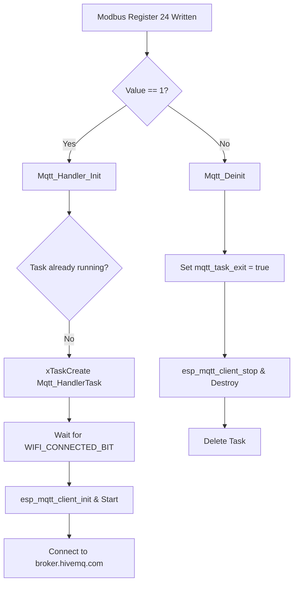

# T3 ESP32 Controller - MQTT Application & Implementation Guide

This document provides a technical overview of the MQTT client implementation on the **T3 ESP32 Programmable Controller** (ESP32-S3 platform). It outlines the architecture, initialization lifecycle, and details the two primary Change-of-Value (COV) paradigms supported by the system.

---

## 1. Architectural Overview

The MQTT integration is located in the [Mqtt_Handler](file:///S:/Shubham/Shubham_Files/TemcoControl/TemcoControl_Tstate_11/T3-programmable-controller-on-ESP32/main/Mqtt_Handler) folder, consisting of:
- [Mqtt_Handler.h](file:///S:/Shubham/Shubham_Files/TemcoControl/TemcoControl_Tstate_11/T3-programmable-controller-on-ESP32/main/Mqtt_Handler/Mqtt_Handler.h): Public APIs, constants, and preprocessor configuration switches.
- [Mqtt_Handler.c](file:///S:/Shubham/Shubham_Files/TemcoControl/TemcoControl_Tstate_11/T3-programmable-controller-on-ESP32/main/Mqtt_Handler/Mqtt_Handler.c): Task initialization, event loop handling, payload serialization (JSON), and polling/filtering routines.

### Key Dependencies
*   **ESP-IDF v5 MQTT Client (`esp-mqtt`)**: Handles transport, TCP connection, TLS (optional), handshakes, and packet retries.
*   **cJSON**: Used for dynamic serialization of BACnet COV data into JSON strings.
*   **BACnet Protocol Stack**: Integrates with BACnet object types, properties, and values.

---

## 2. Initialization & Lifecycle Management

The MQTT client lifecycle is tightly coupled with the controller's main task scheduler and Modbus registers.



### A. Task Spawning (`Mqtt_Handler_Init`)
The function `Mqtt_Handler_Init()` is called during system startup or when a write operation occurs on Modbus Register 24 (`MODBUS_ENABLE_MQTT`):
```c
void Mqtt_Handler_Init(void)
{
    if(Modbus.enable_mqtt)
    {
        if (main_task_handle[19] != NULL) return; // Prevent duplicate tasks
        mqtt_task_exit = false;
        xTaskCreate(Mqtt_HandlerTask, "mqtt_handler", 4096, NULL, tskIDLE_PRIORITY + 2, &main_task_handle[19]);
    }
}
```

### B. Task De-initialization (`Mqtt_Deinit`)
When Modbus Register 24 is written with `0`, `Mqtt_Deinit()` sets `mqtt_task_exit = true`. The task loops terminates, unregisters event handlers, stops the MQTT client, destroys the client handle, and deletes itself.

---

## 3. The Event Loop and Connection Handshake

Inside `Mqtt_HandlerTask`, execution is blocked until Wi-Fi reports connection status:
1.  **Wi-Fi Check:** Blocks on `s_wifi_event_group` until `WIFI_CONNECTED_BIT` is set.
2.  **Configuration:** Configures the client with standard unencrypted TCP:
    ```c
    esp_mqtt_client_config_t mqtt_cfg = {
        .broker = {
            .address.uri = "mqtt://broker.hivemq.com:1883",
        },
    };
    ```
3.  **Event Registration:** Registers `mqtt_event_handler` for connection updates, publishing failures, subscriptions, and TCP/TLS socket transport diagnostics.
4.  **Handshake Pub/Sub:**
    *   **Subscribes to:** `temco/test/tstat11/sub` (QoS 1)
    *   **Publishes to:** `temco/test/tstat11/pub` with connection payload `{"status":"online","device":"tstat11","broker":"HiveMQ"}`.

---

## 4. Change-of-Value (COV) Execution Paradigms

The codebase supports two distinct mechanisms for detecting and dispatching data changes over MQTT. These are configured via macros in [Mqtt_Handler.h](file:///S:/Shubham/Shubham_Files/TemcoControl/TemcoControl_Tstate_11/T3-programmable-controller-on-ESP32/main/Mqtt_Handler/Mqtt_Handler.h).

---

### Mechanism A: "All COV" Mode (`ALL_COV = 1`)

In this mode, the controller acts as an active scanner, periodically polling and calculating state transitions or value deviations for all hardware and virtual registers.

#### 1. Execution Path
When `#define ALL_COV 1`, the `Mqtt_HandlerTask` loop executes `mqtt_check_all_cov()` once every **1000ms**:
```c
while(mqtt_task_exit == false)
{
#if ALL_COV
    mqtt_check_all_cov();
    vTaskDelay(1000 / portTICK_PERIOD_MS);
#else
    vTaskDelay(10000 / portTICK_PERIOD_MS);
#endif
}
```

#### 2. Filtering and Deadband Logic
`mqtt_check_all_cov()` processes three main structural arrays: `inputs[]`, `outputs[]`, and `vars[]`. Points are evaluated based on their range configuration and signal type (Analog vs. Binary):

*   **Analog Points (Inputs/Outputs/Variables):**
    A change is registered if the absolute difference between the current value and the last published value (`backup_mqtt_X[i]`) exceeds a range-specific deadband (scaled by 1000):
    $$\text{Difference} = |\text{Current Value} - \text{Backup Value}| > \text{Threshold}$$

    *   **Low Range / Custom Temp Sensors** (Range $\le 49$ or Range $= 57$): Deadband = `500` (represents **0.5** units).
    *   **Extended Range Sensors** (Range $= 58$, typically CO2/Humidity): Deadband = `10000` (represents **10.0** units).
    *   **Default/Other Ranges:** Deadband = `5000` (represents **5.0** units).
*   **Binary Points:**
    A change is registered immediately if the binary control state (`0` or `1`) changes:
    $$\text{Current State} \ne \text{Backup State}$$

When a change is detected, a mock `BACNET_COV_DATA` packet is dynamically structured, and `Mqtt_Handler_Send_COV` is invoked to serialize and dispatch the update.

---

### Mechanism B: BACnet Subscription COV Mode (`BACNET_SUB_COV = 1`)

Rather than scanning all points, this mode follows the event-driven BACnet standard, where only points with active BACnet subscriptions are published.

#### 1. Execution Path
When `#define BACNET_SUB_COV 1`, the MQTT engine intercepts changes triggered during standard BACnet operations inside [app_main.c](file:///S:/Shubham/Shubham_Files/TemcoControl/TemcoControl_Tstate_11/T3-programmable-controller-on-ESP32/main/app_main.c):
1.  **Received COV Event (`Update_COV_Notify`):**
    Intercepted at line 2428 when a remote BACnet device notifies a change.
2.  **Internal State Change (`Update_Value_List`):**
    Intercepted at line 2522 when local points update, packaging the point's type, instance, value, and lifetime before calling the MQTT publish function.

```c
#if BACNET_SUB_COV
    extern uint32_t Instance;
    cov_data.monitoredObjectIdentifier.type = type;
    cov_data.monitoredObjectIdentifier.instance = original_instance;
    cov_data.initiatingDeviceIdentifier = Instance;
    cov_data.subscriberProcessIdentifier = 1;
    cov_data.timeRemaining = 60;

    Mqtt_Handler_Send_COV(&cov_data);
#endif
```

#### 2. Key Benefits
*   **Bandwidth Efficiency:** Drastically reduces network traffic since unsubscribed points do not generate MQTT payloads.
*   **On-Demand Processing:** CPU resources are only spent on serialization and publishing when a client actively monitors the point.

---

## 5. JSON Serialization and Type Mapping

`Mqtt_Handler_Send_COV` translates structured C structures into a nested JSON schema using cJSON.

### Data Type Translation Matrix
The BACnet application tag type is evaluated and converted into native JSON types:

| BACnet Tag Constants | C Data Type | JSON Output Representation |
| :--- | :--- | :--- |
| `BACNET_APPLICATION_TAG_NULL` | N/A | `null` |
| `BACNET_APPLICATION_TAG_BOOLEAN` | `bool` | `true` or `false` |
| `BACNET_APPLICATION_TAG_UNSIGNED_INT` | `uint32_t` | Number |
| `BACNET_APPLICATION_TAG_SIGNED_INT` | `int32_t` | Number |
| `BACNET_APPLICATION_TAG_REAL` | `float` | Number (Float) |
| `BACNET_APPLICATION_TAG_DOUBLE` | `double` | Number (Double) |
| `BACNET_APPLICATION_TAG_ENUMERATED` | `uint32_t` | Number |
| `BACNET_APPLICATION_TAG_CHARACTER_STRING` | `char[]` | String |
| `BACNET_APPLICATION_TAG_OBJECT_ID` | `BACNET_OBJECT_ID` | Object: `{"type": <num>, "instance": <num>}` |
| *Others (Unsupported)* | N/A | String: `"(unsupported_tag)"` |

### Topic Generation Logic
The topic is constructed dynamically to prevent namespaces from colliding on public brokers:
```c
char topic[128];
snprintf(topic, sizeof(topic), "temco/cov/tstat11/device_%lu/%s_%lu",
         cov_data->initiatingDeviceIdentifier,
         bactext_object_type_name(cov_data->monitoredObjectIdentifier.type),
         cov_data->monitoredObjectIdentifier.instance);
```
*   **Resulting topic:** `temco/cov/tstat11/device_<device_id>/<object_type_name>_<instance>`
